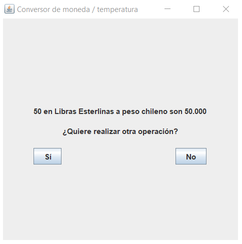

# Challenge completado

### Insignia otorgada por Oracle Next Education - Grupo 5
<p align="center">
  
  
</p>

### Vista inicial
<p align="center">
  
   
</p>

### Opción: Conversor de moneda
<p align="center">
  
   
  
</p>

### Opción: Conversor de temperatura
<p align="center">
  
   
  
</p>

# Requisitos cumplidos:
- [X] ``` Convertir de la moneda de tu país a Dólar ```  
- [X] ``` Convertir de la moneda de tu país  a Euros ```  
- [X] ``` Convertir de la moneda de tu país  a Libras Esterlinas ```  
- [X] ``` Convertir de la moneda de tu país  a Yen Japonés ```  
- [X] ``` Convertir de la moneda de tu país  a Won sul-coreano ```  
- [X] ``` Convertir de Dólar a la moneda de tu país ```  
- [X] ``` Convertir de Euros a la moneda de tu país ```  
- [X] ``` Convertir de Libras Esterlinas a la moneda de tu país ```  
- [X] ``` Convertir de Yen Japonés a la moneda de tu país ``` 
- [X] ``` Convertir de Won sul-coreano a la moneda de tu país ```

#### Extra
- [X] ``` Convertir de grados Celcius a grados Farenheit ```  
- [X] ``` Convertir de grados Celcius a grados Kelvin ```  
- [X] ``` Convertir de grados Farenheit a grados Celcius ```  
- [X] ``` Convertir de grados Kelvin a grados Celcius ```  
- [X] ``` Convertir de grados Kelvin a grados Farenheit ```